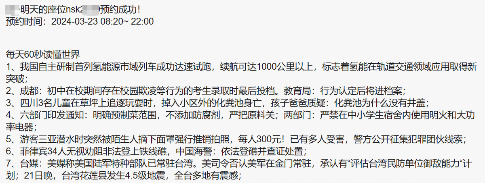

# AHNU座位预约脚本
> 使用Python完成图书馆自动预约座位（安徽师范大学（花津校区）敬文图书馆)
> **2023年8月3日完成。**

### 特别说明
1. 项目在此项目的基础上开发
```  https://github.com/yangchnet/AHNUReserve  ```和
```  https://github.com/liushiyangstd/AHNULibrary ```
2. 本项目在Gitee和GitHub对应项目分别为（GitHub图片显示不出，可到Gitee查看）
> * [Gitee](https://gitee.com/FangYuCoder/AHNULibraryReserve)
> * [GitHub](https://github.com/FangYuCoder/AHNUReserve)
3. 具体变化
> * 最新添加了预约多个用户的功能，并提高了容错率（个人有错误只会在log中显示，不会影响到其他人的预约）
> * 修改邮箱推送为微信推送
> * 增加了预约楼层，具体增加了图书馆2楼，图书馆3、4楼公共空间的座位（以前只可预约3、4楼的部分位置）
> * 修改了当该预约位置冲突时，无法预约下一个位置的BUG，本项目若所预约位置与他人有冲突，则停止预约

### 项目文件说明 
* Reserve.py 主要程序
* GetAndSend.py 获取每日推送程序
* clients 用户信息程序，增删改用户都在此文件夹（随机预约顺序，但需要预约的用户信息一定是.json后缀，若需要暂停下一次预约则将后缀改成其他的比如txt即可）


### 所需Python的库
一般应该都有安装, 可用```  pip list  ```进行查看
* requests
* json
* datetime
* wxpusher（用于微信推送）（通过 `pip install -U wxpusher` 进行安装）
* logging


### 服务器部署
*根据实践，在window系统上可以执行。但在腾讯云Linux服务器上执行代码，无法连接到座位预约系统，但用此代码访问百度等网站都可以，具体原因未知（猜测是服务器设置了某些东西，但没有测试）*

### 解决办法
1. 使用自己的window系统的电脑设置定时任务预约座位
2. 用window系统的服务器去执行定时任务，如果有兴趣的可以尝试一下

### 使用自己的window系统的电脑设置定时任务预约座位
1. 首先使用把代码下载到你的电脑上

2. 修改```  clients/示例.json  ```的配置，该文件主要是关于预约信息的配置，根据下述指导填入你的信息（将个人信息填在引号内，请注意时间前有空格，而且请按照两位数的格式输入）
    ```
    {
        # 推送到微信上的uid
        "uids": [""],
        # 图书馆预约登录账号
        "account": "",
        # 图书馆预约登录密码
        "password": "",
        # 座位编号（例如ngg4e066）
        "sid": "",
        # 预约时间（08:00 ~ 22:00 ）
        # 开始时间
        "dayst": " 14:40",
        # 结束时间
        "dayet": " 22:00"
    }
    ```
3. 修改```  appToken  ```的配置，该文件主要是关于微信推送信息的配置，在```  Reserve.py  ```文件开头部分
	```
	# wxpusher微信推送程序
	appToken = ""
	```
4. 请注意在配置完成后，删除所有#开头的行，也就是删除所有注释，因为这不符合json语法，只为提示填写哪些内容，就如下面代码段即可（没有则忽略）
	```json
	{
  	"uids": [""],
 	"account": "",
 	"password": "",
 	"sid": "ngg4w004",
 	"st": " 08:10",
 	"et": " 22:00"
	}
	```


### 获取```  appToken  ```和```  uids  ```

#### 1. 创建自己的应用，获取```  appToken  ```和```  uids  ```
* 进入[此网站](https://wxpusher.dingliqc.com/docs/#/?apptokenid=%e6%b3%a8%e5%86%8c%e5%b9%b6%e4%b8%94%e5%88%9b%e5%bb%ba%e5%ba%94%e7%94%a8&id=%e6%b3%a8%e5%86%8c%e5%b9%b6%e4%b8%94%e5%88%9b%e5%bb%ba%e5%ba%94%e7%94%a8)根据指导创建应用并得到 ``` appToken```
* 微信扫码订阅应用


* 在WxPusher消息推送平台微信公众号内获取UID


#### 2. 使用已创建的应用，获取```  appToken  ```和```  uids  ```
* 关注WxPusher消息推送平台微信公众号
* 在微信中打开链接 ``` https://wxpusher.zjiecode.com/wxuser/?type=1&id=44774#/follow ```
* appToken填入```  AT_Cxj40nGcDr3fgjLe7oDlzyzE2EuITmWX  ```
* UID获取方式和前面说的一样


## 消息显示


## Window上定时任务
1. 定时任务设置请根据该[指导](http://t.csdn.cn/eEe4t)
2. 关键说明
> 1. 图中的程序或脚本选项选择python解释器的python.exe文件
> 2. 起始于参数是```Reserve.py```所在的文件夹，添加参数就是“Reserve.py”（即文件名带后缀）
3. 添加参数示例


## 避免被发现是脚本的一些优化
1. 经过学长和同学的提醒，使用此脚本可能会造成账号被封，怎么检测的我还不太清楚
2. 我在代码的三个方面加入优化
> 1. 在定时任务启动后，程序会随机延时2~7分钟执行，并且每个用户在预约之前都会延迟1～4分钟，这样每天的预约时间不固定，多用户也错开预约
> 2. 在每次请求的时候会延时10~15秒，防止因为短时间内请求次数过多导致被发现是脚本
> 3. 请求头的 ``` User-Agent```参数修改为通过抓包手机请求的值，模拟手机发送请求
3. 建议在使用的时候注意下面两个问题
> 1. 设置定时任务的时间不要太早，6点开始预约，你可以设置稍微晚一些，晚个十几分钟
> 2. 最好是每过一周或者一段时间就修改一次定时任务的时间，也就是修改预约座位的时间，如果你几个月都是一个时间预约就很明显是脚本

 加了这几个优化应该是查不出来，因为我们的一切都是随机的，和人的操作一样。如果一直使用的是最新的代码还被查出来请和我联系或提交issues。

## 使用说明
1. 图书馆在晚23点到早上6点无法预约，请在设置定时任务注意开始任务的时间
2. 由于不是部署在服务器上，所以电脑需要整夜待机，这是一个问题

## 最后
**有用请给个STAR，欢迎Fork**